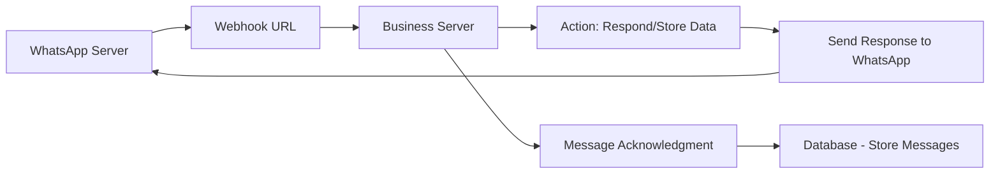
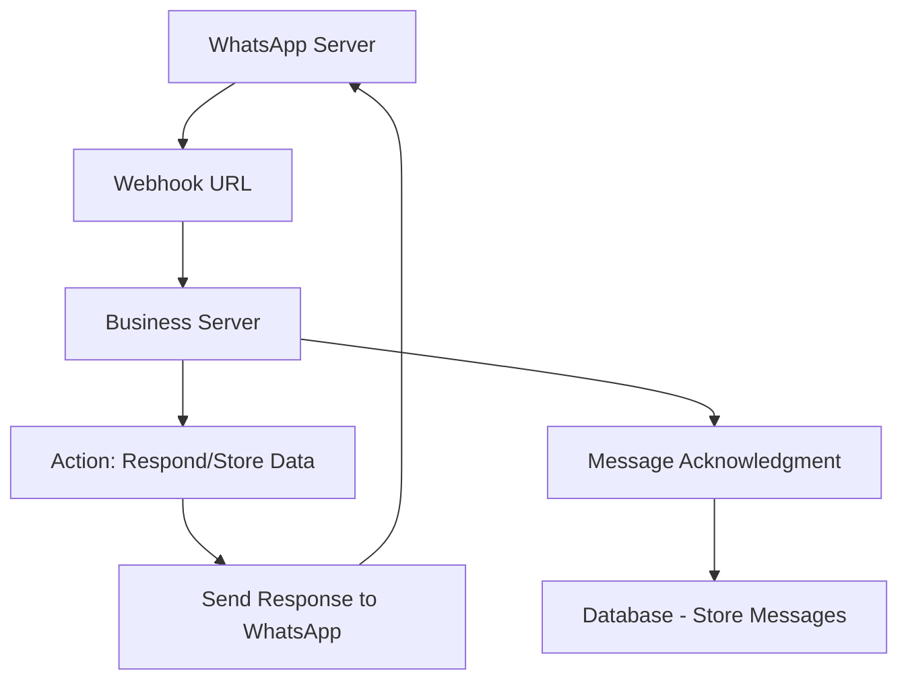
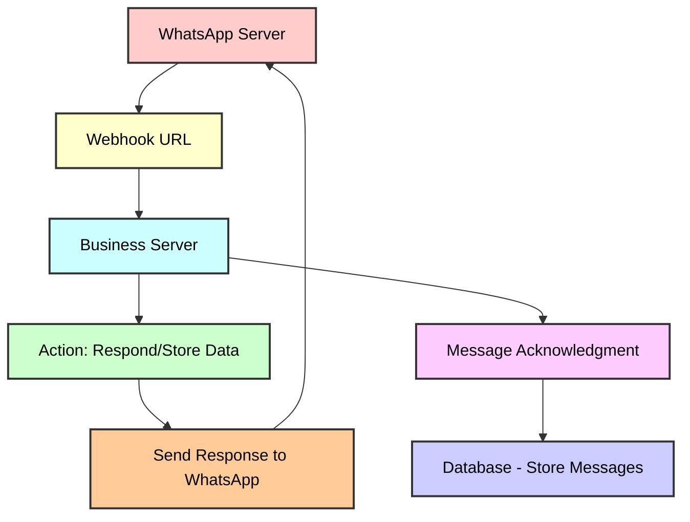
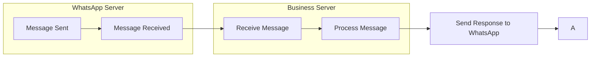

# WhatsApp Architecture

## For better control use 
https://www.mermaidchart.com/

## Diagram 1

```mermaid
graph LR
    A[WhatsApp Server] --> B[Webhook URL]
    B --> C[Business Server]
    C --> D[Action: Respond/Store Data]
    C --> E[Message Acknowledgment]
    E --> F[Database - Store Messages]
    D --> G[Send Response to WhatsApp]
    G --> A

```

## Diagram 2

```mermaid
graph TD
    A[WhatsApp Server] --> B[Webhook URL]
    B --> C[Business Server]
    C --> D[Action: Respond/Store Data]
    C --> E[Message Acknowledgment]
    E --> F[Database - Store Messages]
    D --> G[Send Response to WhatsApp]
    G --> A


```

## Diagram 3

```mermaid
graph TD
    A[WhatsApp Server] --> B[Webhook URL]
    B --> C[Business Server]
    C --> D[Action: Respond/Store Data]
    C --> E[Message Acknowledgment]
    E --> F[Database - Store Messages]
    D --> G[Send Response to WhatsApp]
    G --> A

    %% Invisible link to add space between nodes
    B --- C
```

## Diagram 4

```mermaid
graph TD
    A[WhatsApp Server] --> B[Webhook URL]
    B --> C[Business Server]
    C --> D[Action: Respond/Store Data]
    C --> E[Message Acknowledgment]
    E --> F[Database - Store Messages]
    D --> G[Send Response to WhatsApp]
    G --> A

    style A fill:#ffcccc,stroke:#333,stroke-width:2px,color:#000
    style B fill:#ffffcc,stroke:#333,stroke-width:2px,color:#000
    style C fill:#ccffff,stroke:#333,stroke-width:2px,color:#000
    style D fill:#ccffcc,stroke:#333,stroke-width:2px,color:#000
    style E fill:#ffccff,stroke:#333,stroke-width:2px,color:#000
    style F fill:#ccccff,stroke:#333,stroke-width:2px,color:#000
    style G fill:#ffcc99,stroke:#333,stroke-width:2px,color:#000
```

## Diagram 5

```mermaid
graph LR
    subgraph WhatsApp Server
        direction TB
        A1[Message Sent] --> A2[Message Received]
    end
    
    subgraph Business Server
        direction LR
        B1[Receive Message] --> B2[Process Message]
    end

    A2 --> B1
    B2 --> C[Send Response to WhatsApp]
    C --> A

```
